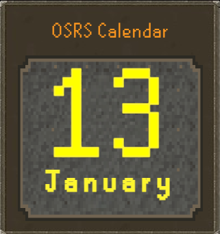

# OSRS Calendar




A simple desktop calendar app built with HTML, CSS, JavaScript, and ElectronJS.  
This project is styled and inspired by the MMORPG _Old School RuneScape_, made by Jagex.

## How to use

### 1. Clone This Repo

```
git clone https://github.com/Brage1025/An-OSRS-Calendar.git
cd An-OSRS-Calendar
```

### 2. Install Node.js

Make sure you have Node.js installed, then run:

```
npm install
```

This should install Electron and any other modules required to run the app.

### 3. Run the App Locally

```
npm run start
```

This will open An OSRS Calendar as a desktop application powered by Electron.

## Requirements

- **Node.js** v18 or newer recommended
- **npm** (comes with Node.js)
- Supported OS:
  - Windows (tested)
  - macOS / Linux (not officially tested)

## Features

- **Old School RuneScape Aesthetic**: Authentic color palette and images scraped from RuneLite and edited to fit the project by me.
- **Authentic Text Font**: Uses the official OSRS text font.
- **Minimalistic Design**: Designed to fit almost any desktop while bringing that OSRS vibe.

## License

MIT License – see the [LICENSE](LICENSE) file for details.

### Copyright

© 2026 Brage1025

This project was made for my own educational growth and is provided solely for educational and demonstration purposes.

## Disclaimer

Old School RuneScape and all related assets are trademarks of **Jagex Ltd.**
This project is **fan-made**, non-commercial, and created for educational purposes only.

## Credits & Attribution

### Developed By

- **Lead Developer**: [Brage1025](https://github.com/Brage1025)
- **Design Inspiration**: Jagex’s [Old School RuneScape](https://oldschool.runescape.com)
- **Image Asset Bases**: Found on the [RuneLite](https://github.com/runelite/runelite) GitHub repository and further edited by me.

## What Electron Template Did I Use?

I used this template by Nasha Wanich:  
https://github.com/nasha-wanich/electron-app-template

Her repository provides a super simple boilerplate. This template provided a clean starting point for building an Electron desktop app and is highly recommended for beginners exploring Electron development.

### Special Thanks

- To the RuneScape guild [Unparagoned](https://secure.runescape.com/m=clan-home/clan/Unparagoned) for all the support, both in-game and out.

### Potentially Planned Features

- [ ] None

## Known Issues

- Window resizing may cause minor layout shifts
- No persistent calendar data between sessions

## How to Contribute

While this project is primarily the result of me messing around with ElectronJS due to a lack of lectures this week, suggestions and help are still welcome:

1. Fork the repository
2. Create a feature branch
3. Make your improvements
4. Submit a pull request

Please ensure your contributions maintain:

- The OSRS theme and vibe.

## Support & Contact

Having problems using this? Feel free to contact me, open an issue, or even submit a pull request:

- **GitHub Issues**: https://github.com/Brage1025/An-OSRS-Calendar/issues
- **Email**: meb102025@gmail.com
- **Documentation**: This README file

---

<div align="center">

Created by Brage1025

_"To &lt;div&gt; or not to &lt;div&gt;, that is the question."_

</div>
